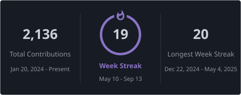

<h1>Robotics &amp; Embedded Systems</h1>

Sensing skins for robots and the on-device AI that turns contact into response.

 

---

### Tech Stack

 

---

### GitHub Stats

 

---

### Connect

<a href="https://artemisrobotics.org/"><strong>artemisrobotics.org</strong></a>

